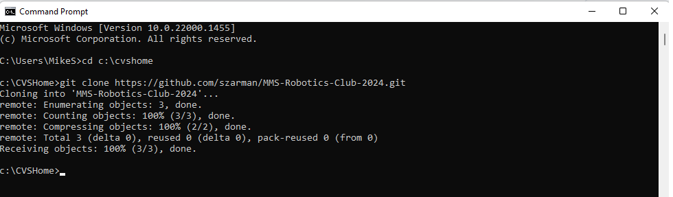
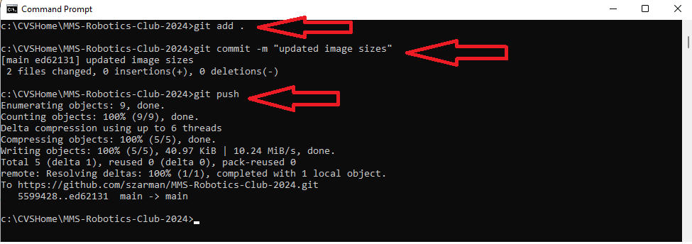

# MMS-Robotics-Club-2024

Repo for hosting common code functions, team projects, and test code

## IDE
   VEX IQ https://codeiq.vex.com/
   Version: VEXcode IQ 4.0.5-1

## Getting Started

### Clone Repo
   1) Navigate to Repo in your browser
   2) Click the Code button
   3) Click the copy button

   4) Open Command Prompt on computer
   5) Type in path to where you want it stored "cd C:\CVSHome"... in my case I store it on my computer at C:\CVSHome, cd is the command to go to that folder
   6) Type in "git clone https://github.com/szarman/MMS-Robotics-Club-2024.git" (this is the link you copied in step 3)

## Commit Updates

Updates are done locally on your computer, change, add, update anything in the folder.  Once it is tested, or working you can push it to GitHub with the following commands (there is also a desktop GitHub client to make it easier but I will start here because it is really just 3 commands)

   1) Open Windows Command Prompt
   2) Go to file path where your GitHub repo exist (mine is in C:\CVSHome you will change that to wherever it resides on your PC) by typing "cd C:\CVSHome"
   3) Type "git add ."
   4) Type "git commit -m "comment about what is changing"
   5) Type "git push"

At this point everything that you did is safely stored in the cloud.  Other people can clone it, or pull updates into their local folder.